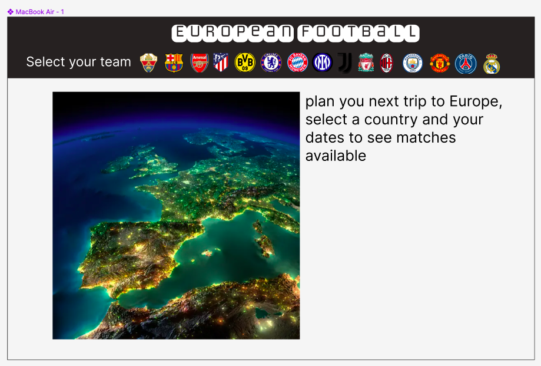
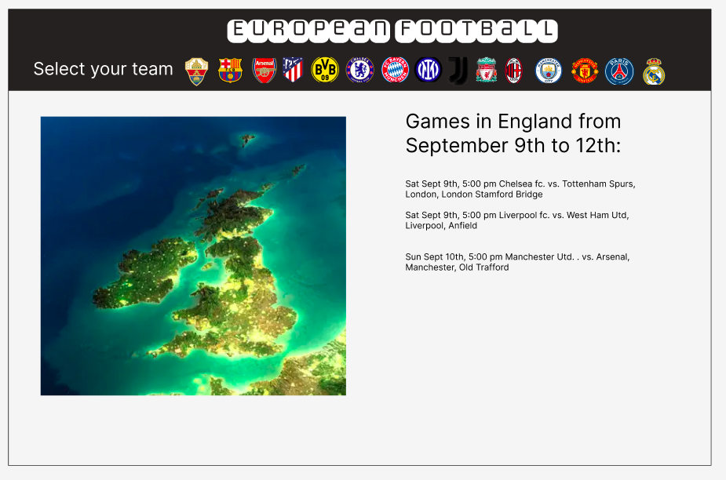
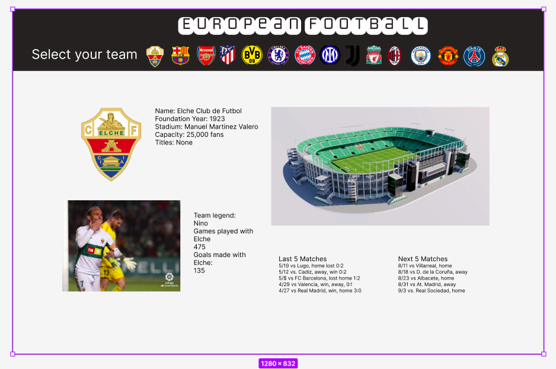

#European Football

This website will serve as a valuable resource for travelers visiting Europe who are interested in exploring some of the region's top football teams. With its user-friendly interface, the website will provide essential information about scheduled matches, team statistics, and an overview of the overall competitive landscape.

https://manupaalc.github.io/European-Football/

##Technologies used:

1.  Frontend: HTML, CSS, and JavaScript were used to create the user interface and interactivity of the web         application.

2.  Map Visualization: D3.was employed to draw an interactive map of Europe, displaying football team information and fixtures.

3.  Backend: Node.js with Express.js as the framework served as the lightweight proxy server, allowing communication with third-party APIs and avoiding CORS issues.

4.  HTTP Requests: Axios, a JavaScript library, facilitated making API requests from the frontend to the backend proxy server.

5.  Data Format: JSON was used for data exchange between frontend and backend, as well as for storing GeoJSON data for map visualization.

6.  Version Control: Git and GitHub enabled efficient collaboration, version tracking, and code sharing among team members.

7.  Environment Variables: Sensitive data, such as API keys, was securely stored using environment variables on the server-side.

##Challenges:

1.  Interactive map visualization:

    Challenge: Creating an interactive map of Europe using D3.js required handling GeoJSON data and managing event interactions efficiently.
    Solution: By using D3.js for map rendering and proper data manipulation, the team achieved a seamless and responsive map experience. Event listeners were utilized to allow users to click on countries, view tooltips, and highlight selected countries for trip planning.

2.  Backend Proxy with axios request
    Challenge: Making API requests directly from the frontend using Axios to third-party APIs could lead to empty response when passing more than one argument.
    Solution: Adapt the proxy logic to pass the arguments as params before the url just when there is more than one argument to pass.

this would be the wireframes desired:

In this project, we will utilize the following technologies, libraries, and APIs:

Data Sources:

SportsDB API: We will leverage the SportsDB API to access comprehensive data related to football clubs, leagues, and match information. This API will provide us with valuable insights into various football teams, their statistics, and upcoming fixtures.
API-Football: Additionally, we will use the API-Football to access extensive data on football clubs, players, and match events. This API will complement our data sources, enhancing the depth and accuracy of the information available to users.
Data Visualization:

D3.js: To present data in a visually compelling manner, we will employ D3.js, a powerful JavaScript library for data visualization. D3.js will enable us to create interactive charts, graphs, and most importantly, an interactive map, showcasing the stadium locations of European football clubs.

Implementation Timeline:

Friday Afternoon & Weekend:

Research and select suitable APIs for football data.
Set up the project structure, including directories and files.

Monday:

Implement basic HTML structure for the website.
Integrate the SportsDB API to fetch football club data.
Display club information and upcoming matches for selected clubs.

Tuesday:

Incorporate the API-Football data to enhance club details and match events.
Build the data visualization using D3.js for the interactive map.
Style the website's layout and elements using CSS.

Wednesday:

Refine data visualization with interactive features and animations.
Test and debug the website across different browsers and devices.
Finalize the README.md with project details and instructions.
Thursday Morning:

Prepare for the presentation and rehearse the demo.
Deploy the project to GitHub Pages for online accessibility.